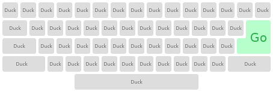
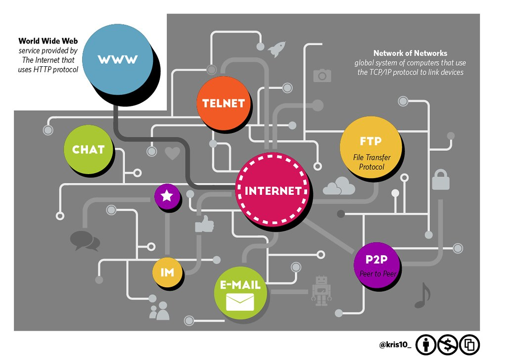
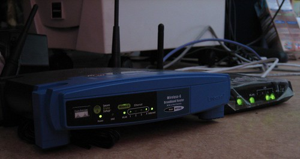
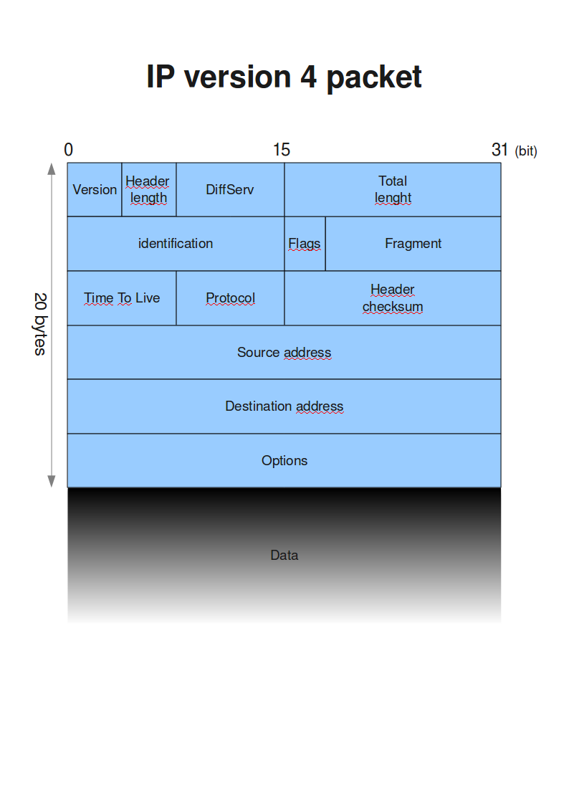
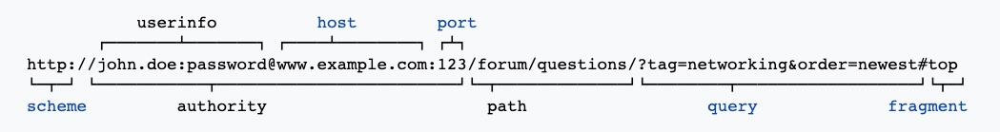
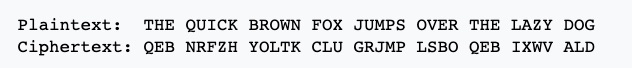

|  |
|:--:|
| [“DuckDuckGo Keyboard”](https://www.flickr.com/photos/76675068@N08/6874492881) by [hasOwnProperty](https://www.flickr.com/photos/76675068@N08) is licensed under [CC BY 2.0](https://creativecommons.org/licenses/by/2.0/?ref=ccsearch&atype=rich) |
I’ve often wondered what actually happens when I type in a URL like [duckduckgo.com](http://duckduckgo.com) (my preferred tracker-free search engine), [nytimes.com](http://nytimes.com), or [even this very website](https://cynthiadominguez.com), to my browser. I figured it was about time to understand the process. If you’re a user of the Internet, I want to invite you on this journey to understand it, too. After all, understanding how your web requests are handled is the first step in learning how to safeguard your personal data while it travels across the Internet. Since companies and governments can learn about us and [monetize our data through our online behaviors](https://www.nytimes.com/interactive/2019/08/23/opinion/data-internet-privacy-tracking.html?te=1&nl=the-privacy%20project&emc=edit_priv_20190827?campaign_id=122&instance_id=11912&segment_id=16519&user_id=80fda82107eea58a5092ff8c277eaaa8&regi_id=91522179), we might as well get a grip on how exactly this happens.

**That’s scary. Why can’t we go back in time when the Internet was a friendly place?**

Good call. Let’s grab a blanket and a hot cup of tea so we can start our journey through the inter webs. If you want to reminisce about the dial-up Internet of the 90’s, please go ahead and play [that lovely dial-up sound that your modem made](https://www.youtube.com/watch?v=GSRG0TqxLWc). Do you hear that? It’s a whole lot of servers passing along your request to get a web site to render on your screen. We’re going to visualize our web request moving through the various layers of networking that is the Internet.

**But first, let’s take a step back.**

It’s helpful to frame this whole research quest in terms of _information sharing_. If we want to send information, in this case, our web request, to the web server, we will need a way to send the request through the network. There will be several intermediaries for the data to travel through, and we must ensure that all of the information arrives at its destination securely and uncorrupted. For this reason, we have protocols which the data must meet while it is traveling, in order to proceed to the next node (like a router, server, or host of the website). Protocols ensure that a minimum requirement is met for the data to continue on its way. There are several protocols, but the most relevant one is the TCP/IP protocol.

**TCP = Transmission Control Protocol / IP = Internet Protocol**

Before we jump into the multi-layered TCP/IP Model, let’s look at the protocol that governs the Internet.

|  |
|:--:|
| [“Old Card Catalog/Computer Area”](https://www.flickr.com/photos/65695366@N00/1153094645) is licensed under [CC BY-NC-ND 2.0](https://creativecommons.org/licenses/by-nc-nd/2.0/?ref=ccsearch&atype=rich) |

I’m writing this from my local public library. There are several comparisons to draw between our favorite public library and how we would want to navigate to a specific website. We know the name or author of the book we want to find, but in order to find it quickly, we’ll need to know the catalog number of our book. A **DNS** (Domain Name System) request works very much the same way. The catalog number is like the address of the book we want to find. Web pages work the same way. The address of a web page is their [IP address](https://en.wikipedia.org/wiki/Internet_Protocol), or (“Internet Protocol”) address. We’ll explain this, among other protocols governing each step of the process beginning with hitting enter all the way to when the page renders what you want on your screen.

Let’s say we need to look up the IP address of [duckduckgo.com](http://duckduckgo.com). When we type the site name, and then enter, our web browser asks our router for the IP address. If we’ve looked for this site before, our browser should already have the DNS server address stored. If not, it does not immediately ask the DNS server for the IP address of [duckduckgo.com](http://duckduckgo.com). So where does it send this request first? The request first goes to the DNS cache, or DNS resolver cache. This is like a temporary database of IP addresses of the sites that you’ve browsed to. Its purpose is to help get better performance when you’re using the Internet since the goal is not to make a repeat request to the DNS servers.

**The TCP/IP Protocol Suite**

Protocols are important because they set up common standards for networks to communicate with each other in the proper way. We’re lucky to live in an age of smooth networking because before a governing organization (the [ISO](https://en.wikipedia.org/wiki/International_Organization_for_Standardization)) defined these standards, there were plenty of incompatibilities between various vendors of computer networks. This caused inconsistent or nonexistent communications.

These TCP/ICP protocols allow computers from different vendors, running various operating systems, to communicate. So someone running MacOS can send data to someone running Linux, and they in turn can send data to someone running Windows. Specifically, the protocol specifies how data should be “packetized, addressed, transmitted, routed, and received.” _See_ [Internet protocol suite](https://en.wikipedia.org/wiki/Internet_protocol_suite)

We’ll walk through all four layers of the [TCP/IP Model](https://www.geeksforgeeks.org/tcp-ip-model/) and what these layers correspond to.

**_1 — Link Layer_**

Your computer, your router at home, the server at your Internet Service Provider, and the end-host of the website you navigate to, are all examples of stops, or links in the chain, where your web request is delivered. Inside your web request is data, which is delivered in **packets**. If you imagine that you’re waiting for a package to be delivered to your house, you know there must be some information about that package on the outside where everyone can see it. For each packet, this is called the **header** and it includes the destination IP address, and your (origin) IP address, among other things. The purpose of this layer is carry your data over link-by-link. Do you use [WiFi](https://en.wikipedia.org/wiki/Wi-Fi)? WiFi is an example of a [Link Layer](https://en.wikipedia.org/wiki/Link_layer), and so is [Ethernet](https://en.wikipedia.org/wiki/Ethernet) and [DSL](https://en.wikipedia.org/wiki/Digital_subscriber_line).

Let’s not forget the use of a [firewall](https://ssd.eff.org/en/glossary/firewall) to ensure that packets are safely arriving at their destination. A firewall is used to filter healthy packet traffic whether it is incoming or outgoing, based on a set of security rules. These rules may prevent unwanted connections to particular websites deemed as unsafe. They are also the first line of defense to protect the network from interference.

**_2 — Network Layer (a/k/a the Internet Layer)_**

The Link Layer provides its service to the Network Layer, which is responsible for accepting and sending packets until the packet gets to its destination. You can read more about the different types of packets, but for now, just know that network layer packets are also called **datagrams**. Cute, right? We used to send telegrams, but now we just send datagrams that are re-assembled to display the page you want. This is where the **Internet Protocol**, or IP comes into play, as discussed above.

Another important protocol belonging to this layer is the ARP (Address Resolution Protocol), which matches the IPv4 address (such as 8.8.8.8) to the physical address, or MAC address.

Using ARP, your computer will check its ARP cache to see if there is already a resolved MAC address of the destination device it wants to communicate with. If there is no resolved MAC address, it will prepare and send an ARP request message, along with a destination MAC Address in a broadcast format. This means that every device on the local area network ([LAN network](https://en.wikipedia.org/wiki/Local_area_network)) will receive this request, but if the destination MAC address is not theirs, those machines will simply drop the packet. However, if the machine with the correct IP address receives the requests, it will reply back confirming that your computer has found the matching computer it wants to communicate with.

It is important to note that ping communications on this level are open. [ARP spoofing](https://en.wikipedia.org/wiki/ARP_spoofing) is possible by an attacker who impersonates the MAC address, thus causing traffic meant for the legitimate IP address to be sent to the attacker instead. This is known as a machine-in-the-middle attack. This type of attack requires the attacker to have access to the local network segment. Do you use WiFi? Consider using a [Virtual Private Network](https://ssd.eff.org/en/module/choosing-vpn-thats-right-you).

**_3 — Transport Layer_**

I’d like to think of this layer as the “how” of communication between hosts. There are two commonly used Transport Layer services. One method is very reliable when sending and receiving packets. The other is not.

_Transmission Control Protocol (TCP)_

This method ensures that data is being transferred in chunks that are just right for the host to be able to handle. It also receives an acknowledgement for every packet sent. This is ensured by way of a handshake.

The _three-way-handshake_ is the process TCP uses to establish a connection with the correct destination. In the packet’s header are flags called **SYN** and **ACK**, which stand for _synchronization_ and _acknowledgement_, respectively. The first “handshake” is the SYN flag set to the destination. The second handshake is the destination’s response with both the SYN and ACK flag set. The final handshake is the source’s response with only the ACK flag set.

_User Datagram Protocol (UDP)_

I think of this method of data transfer as the sloppy little sibling of TCP. Why? UDP is not connection-oriented and there is no guarantee that packets sent are received by the host. UDP simply wraps up the application data and passes it off to the Network Layer for delivery. It is, however, faster than TCP. So, where speed matters, such as a live video conference, it may be better to ensure a faster stream of packets, rather than ensure every single packet arrives to the host.

**_4 — Application Layer_**

Let’s go through some important examples of protocols that live in the Application Layer. This has to do with the standardization of the exchange of our data, and more importantly, the security of that data.

_HTTP (Hypertext Transfer Protocol)_ is the main protocol for hypertext documents and hyperlinks, which make up the World Wide Web. URLs are encoded as hyperlinks, which we are familiar with. There are optional components to a hyperlink that include not just the scheme:http, or the host:www.example.com, but also the port:80 as well as the path, query, and fragment, as shown in the snippet above.

|  |
|:--:|
| [“https”](https://www.flickr.com/photos/18090920@N07/15944989872) by [Sean MacEntee](https://www.flickr.com/photos/18090920@N07) is licensed under [CC BY 2.0](https://creativecommons.org/licenses/by/2.0/?ref=ccsearch&atype=rich) |

[HTTPS](https://ssd.eff.org/en/glossary/https) (the S stands for SECURE) _is used to ensure that the privacy and integrity of the data is intact while in transit. Remember how the packets include both the host and origin addresses, as well as the port numbers in their headers? This information can not be protected by HTTPS because it is necessary for TCP/IP delivery to the destination host, but other information such as the request URL, [cookies](https://ssd.eff.org/en/glossary/cookies) (which may contain personal identifying information about the user), and query parameters can be encrypted.

The transformation can be represented by aligning two alphabets; the cipher alphabet is the plain alphabet rotated left or right by some number of positions. For instance, here is a Caesar cipher using a left rotation of three places, equivalent to a right shift of 23 (the shift parameter is used as the [key](https://en.wikipedia.org/wiki/Key_%28cryptography%29)). _Credit_: [Wikipedia](https://en.wikipedia.org/wiki/Key_%28cryptography%29)

**What is this smoke and mirrors you refer to as encryption?**

[Encryption](https://ssd.eff.org/en/glossary/encryption) plays a major role when securing all of your packets sent via many different servers. Basically, it is a method that takes the message and makes it indecipherable, except to the person who has the way to decrypt it back into its original format.

_TLS/SSL_ (Transport Layer Security/[Secure Sockets Layer](https://ssd.eff.org/en/glossary/secure-sockets-layer-ssl) are both cryptographic protocols to ensure that communication between two computers stays intact. For example, an email message may make several “hops” between servers before it arrives at its host email server. Those hops can be encrypted. However, there is a negotiation phase first before all of these hops happen. Both the client and the server negotiate a “stateful” connection by using a handshake with a cipher or [cryptographic hash function](https://en.wikipedia.org/wiki/Cryptographic_hash_function). Communication going forward is then encrypted. Since the negotiation phase is sent in-the-clear, any server, or computer monitoring traffic in-between could either drop the communication or even impersonate the destination email server. _See_ [STARTTLS FAQs](https://starttls-everywhere.org/faq/)

The other Transport Layer encryption example is HTTPS. If you want to implement several ways to encrypt your data, check out [“What Should I Know About Encryption”](https://ssd.eff.org/en/module/what-should-i-know-about-encryption) from the Surveillance Self-Defense Guide.

**Load Balancer**

By now, the Internet has got to seem like the Wild West. That’s why we need load balancers to ensure that client requests (like _your_ request to see [duckduckgo.com](http://duckduckgo.com)) get distributed efficiently to the servers that can handle them. To do this, load balancing involves the use of algorithms to filter and sort traffic to direct it to the servers that are ready to handle such requests.

Examples of a load balancing algorithm are:

- Round robin: The requests are distributed across the cluster of servers in strict sequential order, like dealing cards. This method works best with simple incoming traffic.
- Least connections: The requests are sent to the server with the fewest current connections to clients at the given moment. This method can handle spikes in traffic.

**Application Server**

This type of server is designed to create web applications and maintain a server environment for them to run in. For example, any web application you currently use (Slack, Signal, Discord, Spotify, etc.) will have a designated application server which will call data from a shared database.

**Database**

The database is a collection of data organized so that it can be accessed efficiently by an application. The application server queries the database, and the unique data requested is presented and displayed as needed by the web application.

**Are we there yet?**

Yes! If you successfully navigated to [nytimes.com](https://www.nytimes.com/interactive/2019/opinion/internet-privacy-project.html), congratulations! Your request went through all of these steps, then went through all the reverse steps to get back to you. You can now read all the news that’s fit to print. Time for another cup of tea.

**Resources**

[The NY Times Privacy Project](https://www.nytimes.com/interactive/2019/opinion/internet-privacy-project.html)  
[Farhad Manjoo, “I Visited 47 Sites. Hundreds of Trackers Followed Me.” (New York Times Privacy Project)](https://www.nytimes.com/interactive/2019/08/23/opinion/data-internet-privacy-tracking.html?te=1&nl=the-privacy%20project&emc=edit_priv_20190827?campaign_id=122&instance_id=11912&segment_id=16519&user_id=80fda82107eea58a5092ff8c277eaaa8&regi_id=91522179)  
[The TechLogy OSI Model and TCP IP Model Complete Guide, by Praveen Kumar](https://thetechlogy.com/osi-and-tcp-ip-model/)  
[TechRepublic, Exploring the anatomy of a data packet, by Michael Mullins](https://www.techrepublic.com/article/exploring-the-anatomy-of-a-data-packet/)  
[Surveillance Self-Defense Guide, EFF.org](https://ssd.eff.org/en)

_Varies slightly from the original post, published August 25, 2019 on_ [_Medium.com_](https://medium.com/@671_31477/what-happens-when-you-type-web-page-url-in-your-browser-and-press-enter-1e9b85d04bcb)