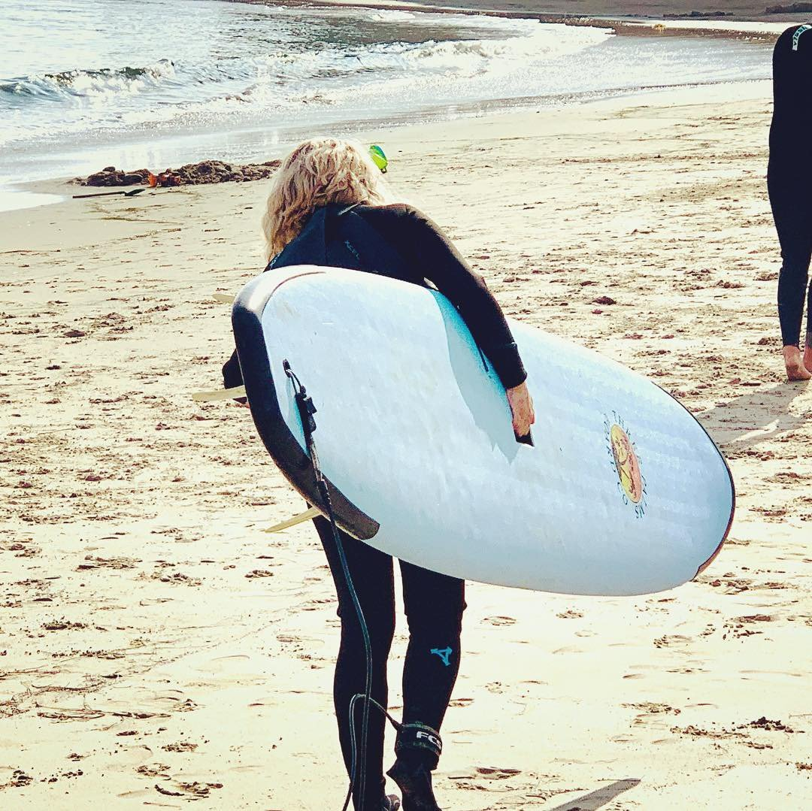

Hi! I’m a software engineer with previous careers in finance, law, and running my own business. Most recently, I completed projects in C and Python while studying a full-stack curriculum. I’m particularly interested in user accessibility and privacy and how we can make advances in technologies more relevant to people from a variety of backgrounds, viewpoints and experiences.

If you know of an opportunity I might be a good fit for, check out [my resume](https://www.visualcv.com/cynthiadominguez/) and drop me a line at cmdominguez at gmail dot com.

Before pivoting to software engineering, I worked on the legal team at [EFF](https://eff.org), where I got to make an impact defending users’ rights on the Internet. As a non-lawyer, I wore many hats working with technologists and activists on Diversity & Inclusion initiatives.

At any given moment, you can find me working through the [Python Crash Course](https://ehmatthes.github.io/pcc_2e/) book I won by telling a joke at PyBay, tweaking the documentation on my C projects, or looking for nice spots to surf.
