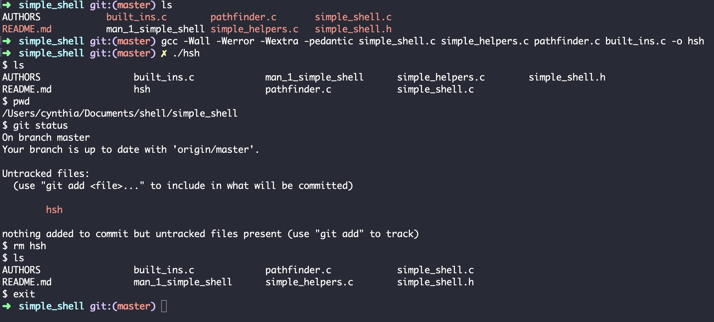

## Simple Shell in C

I truly enjoyed creating a [simple shell in C](https://github.com/cynergist/simple_shell), and would really like to do this again in Python, Ruby, or C++. There are a few reasons why this project was so informative. First, the exercise in building a shell in C did not allow use of C’s standard libraries.  This was an interesting challenge because, when I needed to, for example, copy a string of characters to a new destination, instead of using `strcpy` from the stdio.h or string.h libraries, I had to create custom functions that would do this for me. I probably wouldn’t make the choice to use my custom functions in a production-ready shell because I trust that the standard libraries include an optimized version of these functions. However, it was a useful exercise that helped me understand what is happening byte-by-byte when we have `argv` input from the command line and that input is tokenized and used to search the built-ins or PATH programs. 

It is important to know how much memory is being called because there may be a circumstance where we’re asked to build hardware that has a limit on the amount of memory it can provide (theoretically!).  For this reason, we used system calls only when necessary.  My favorite system call from this project was `fork` because in order to use it, I needed to understand: 

1. What the child process was doing while the parent would `wait`, and

2. When the child needed to be terminated, and how.

My contributions to this project were:

+ The [main function](https://github.com/cynergist/simple_shell/blob/master/simple_shell.c)
+ The “helper”, or [custom functions](https://github.com/cynergist/simple_shell/blob/master/simple_helpers.c), and 
+ The [built-in functions](https://github.com/cynergist/simple_shell/blob/master/built_ins.c).  

